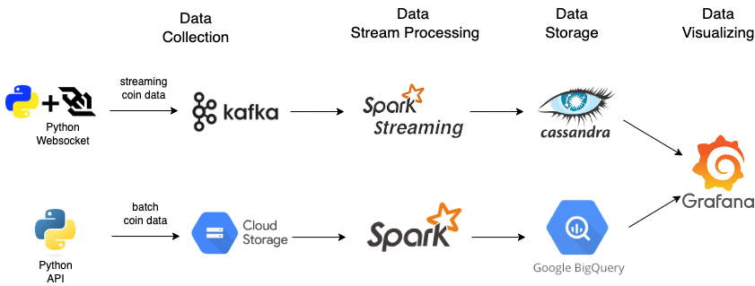
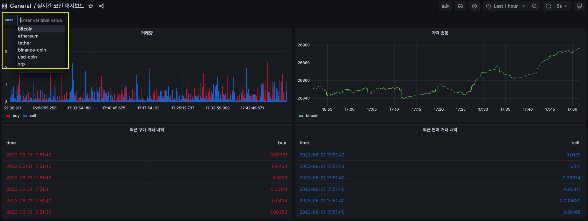
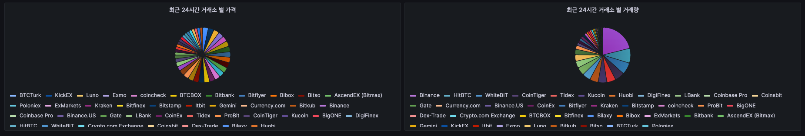

# Coin Project
- 실시간 코인 거래, 가격 데이터를 통해 실시간 가격 변동, 거래량을 확인할 수 있는 대시보드 구축
- 3개의 Mac 서버(8gb, n core) 자원을 활용해 각 플랫폼들의 클러스터를 구성

#### **Key Element 1. 스트리밍, 배치 코인 데이터 수집 파이프라인 구축**
- 실시간 코인 거래, 가격 정보와 최근 24시간 동안의 거래소 별 코인 데이터 수집 파이프라인 구축
- 데이터 소스에 맞게 파이프라인 설정, 단일 대시보드 구축

#### **Key Element 2. 데이터 일관성, 정합성보다 처리량, 가용성**
- 코인 별 실시간 변화량 및 추세를 보기 위함으로 일부 데이터의 유실보다 가용성과 처리량을 중심으로 설계
- 3개의 서버, 3개의 노드로 클러스터를 구성하여 가용성, 내결함성 처리
- kafka produce ack, cassandra consistency level을 가용성, 처리량을 중심으로 설정

#### **Key Element 3. 데이터 lifecycle을 자동으로 관리**
- 지속적으로 쌓이는 데이터들을 관리하기 위해 데이터의 lifecycle 관리
- kafka 브로커들의 RETENTION_HOURS 설정, cassandra db 적재시 TTL 설정, GCS bucket의 TTL 설정

## Kafka
#### Kafka cluster
- 3개의 서버, 3개의 노드로 클러스터 구성
- 카프카: 내결함성, 로드밸런싱을 통한 처리량 증가
- 주키퍼: 주키퍼의 쿼럼 기반 시스템으로 인해 가용성을 위해 주키퍼 앙상블을 3개의 노드로 구성
#### Topic Replication Factor 
- topic replication factor가 2일 경우: 1개의 노드 장애 발생 시 데이터 유실 없음, 2개의 노드 장애 발생시 데이터 유실 발생
- topic replication factor가 3일 경우: 2개의 노드 장애 발생시에도 데이터 유실 없음
- 데이터 유실과 서버 리소스 사용 사이의 trade off를 고려해 topic replication을 2로 설정
- topic replication factor ⬆: 브로커의 장애 시 데이터 유실 확률 ️⬇️, 디스크 저장 공간 사용⬆, 네트워크 트래픽⬆
#### Producer Ack
- 실시간 스트림 데이터의 토픽의 경우 처리량이 중요하지만 리더 파티션에 적상적으로 적재되었는지 최소한의 응답을 확인하기 위해 ack = 1(기본값)으로 설정
#### Data Lifecycle
- RETENTION_HOURS을 24로 설정함으로 인해 최근 24시간 동안의 데이터만 보관

## Cassandra
#### Cassandra cluster
- 3개의 서버, 3개의 노드로 클러스터 구성
- 클러스터 구성으로 인해 가용성, 쓰기 분산으로 인해 처리량 향상
- Cassnadra는 마스터, 슬레이브 구조가 아닌 분산 아키텍쳐이기 때문에 스케일 아웃으로 인한 쓰기 작업의 부하 분산
#### Consistency Level
- **Consistency Level**을 **ONE**으로 설정함으로써 최소한 1개의 노드에 쓰기 작업이 성공적으로 수행됨을 확인
- 최소한의 일관성을 유지하면서 높은 처리량을 수행
#### Data Lifecycle
- cassandra에 데이터 적재 시 TTL을 3600초로 설정함으로써 최근 1시간 동안의 데이터만 보관
## Grafana
- 실시간 스트림 데이터를 저장하는 Cassandra와 배치 데이터를 보관하는 Bigquery의 데이터를 단일 대시보드를 구성 
- 어떠한 시각화 툴을 사용할 지 요금 및 Cassandra, Bigquery 연동 여부를 고려하여 결정

| 제품 | 요금 | cassandra 연동 | bigquery 연동 |
| ------ | :------: | :------: | :------: |
| Superset | **무료** | X | **O** |  
| Tableau | 유료 | **O** | **O** |  
| **Grafana** | **무료** | **O** | **O** |  
| Kibana | **무료** | X | **O** |  

## Coin Dashboard

- 좌측 상단에서 특정 코인을 선택하면 해당 코인에 대한 시각화 대시보드를 볼 수 있음
- 실시간 스트림 데이터의 시각화 대시보드(**거래량, 가격 변동, 최근 구매 및 판매 내역**)
- 배치 데이터의 시각화 대시보드(**최근 24시간 거래소 별 가격 및 거래량**)

### 플젝하면서 어렸웠던 점
- 1. 실시간 스트림의 처리량을 감당하는것 (카산드라)
- 2. 클러스터 구성, 가용성 확보 및 로드밸런싱을 위해 클러스터를 구성했는데 막상 이게 잘 동작하는지 모르겠음(따라서 하나의 노드들을 종료시켜봄
-- 1) 카프카 active controller 브로커를 종료시켰을 때 새로운 브로커가 active controller가 되는가
- 3. lag 따라잡기 

> 카프카의 복제본과 내결함성으로 여러 노드에 복제본을 저장해두어 토픽의 리더, 팔로워에서 리더가 죽더라도 다른 팔로워가 리더가 되어 내결함성을 유지할 수 있음

> 주키퍼는 분산 애플리케이션에서의 메타 데이터 관리, 동기화, 그룹서비스 등을 제공함, 주키퍼를 이용해 브로커 상태를 추적하고 토픽 및 파티션 메타데이터를 저장한다.
> 주키퍼 앙상블은 가용성과 내 결함성을 위해 최소 3개 이상의 홀수로 구성하는 것이 좋다. 주키퍼는 쿼럼(quorum, 과반수) 기반 시스템으로 서비스를 계속 제공하기 위해 쿼럼을 유지해야한다. ex) 2개의 노드에서 하나가 실패하면, 쿼럼을 유지할 수 없게 되어 서비스가 중단된다.

